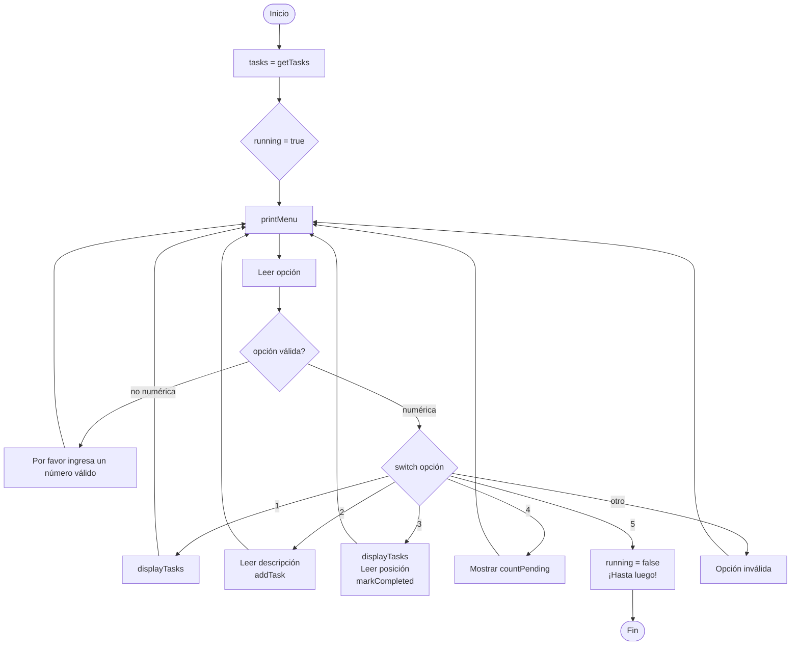
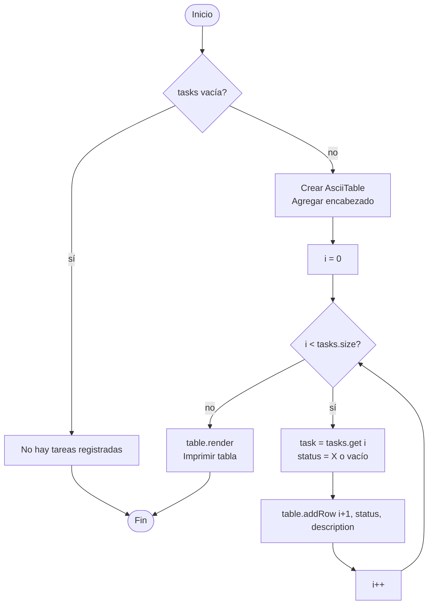
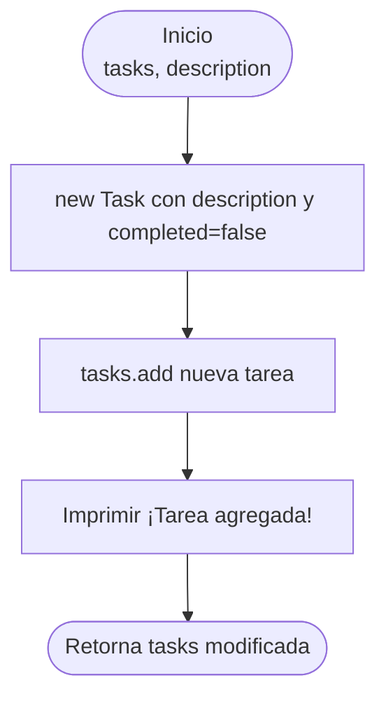
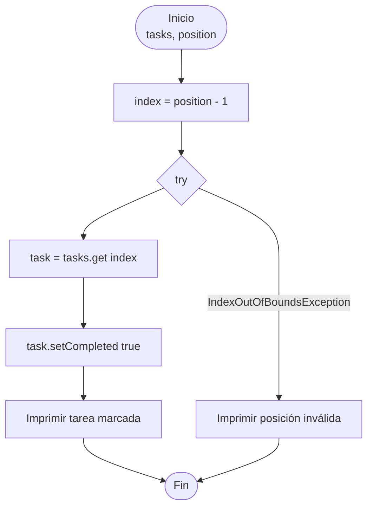
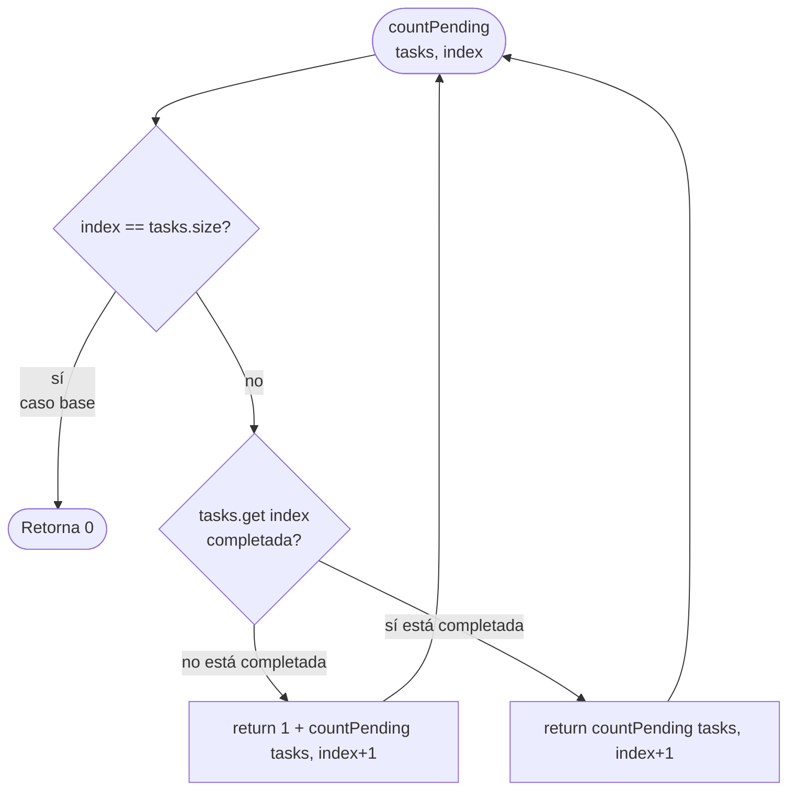

# Diagramas de flujo — todo-cli

Diagramas Mermaid para cada método principal de `TaskManager.java`.

---

## 1. Menú principal — `main()`



---

## 2. Mostrar tareas — `displayTasks()`



---

## 3. Agregar tarea — `addTask()`



---

## 4. Marcar completada — `markCompleted()`



---

## 5. Contar pendientes — `countPending()` recursivo



**Traza con lista `[pendiente, completada, pendiente]`:**

```
countPending(tasks, 0)
  → tasks[0] pendiente → 1 + countPending(tasks, 1)
      → tasks[1] completada → countPending(tasks, 2)
          → tasks[2] pendiente → 1 + countPending(tasks, 3)
              → index == size → return 0
          → return 1 + 0 = 1
      → return 1
  → return 1 + 1 = 2
```
